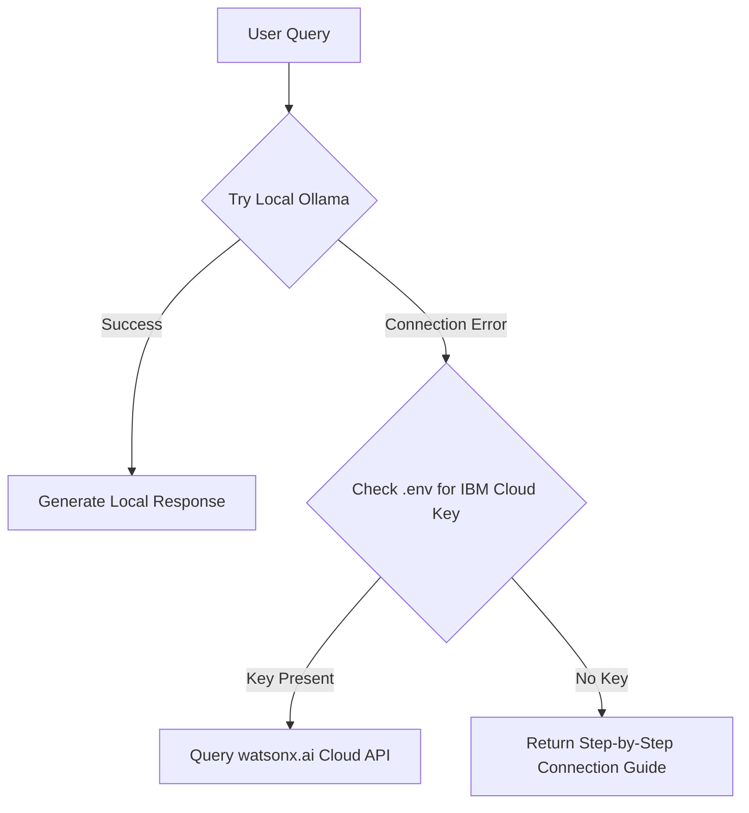

# InsightOS 📊

**InsightOS** is an intelligent, real-time Business Intelligence and Retail Operations Platform built specifically for multi-outlet retail networks. It processes raw Point-of-Sale (POS) transaction logs and inventory stock data to detect critical anomalies, map store efficiency geographically, categorize products via Pareto optimization, and provide a conversational AI business assistant using **IBM Granite LLMs**.

---

## 🚀 Key Features

* **Interactive Multi-Store Dashboard**: Monitor gross revenue, net profit margins, total units sold, and operational risks at a glance.
* **Geospatial Store Heatmap**: Interactive map visualizing store locations, revenue tiers, and risk levels using circle markers (radius scales with sales volume).
* **Smart Alert & Remediation Center**: Automated anomaly detection highlighting stockouts, low margins, and underperforming stores with step-by-step action plans.
* **IBM Granite AI Business Assistant**: A context-aware chatbot powered by IBM Granite (running locally via Ollama or falling back to IBM Cloud watsonx.ai) to answer strategic operational questions.
* **Analytics & Pareto Optimization Studio**: View MoM/daily trends and automatically categorize inventory into Class A, B, or C products using ABC classification.
* **Fuzzy CSV Ingestion normalizer**: Upload custom POS or inventory CSV sheets. The normalizer automatically maps custom column names (e.g., *'Qty'*, *'Sales Price'*, *'Date'*) to canonical fields.
* **Photo-to-CSV Scanner**: Snaps and parses invoices/receipt receipts into clean, structured CSV format for direct analysis.

---

## 🛠️ Technology Stack

* **Frontend**: React 19, TypeScript, Vite, TailwindCSS v4
* **Charts & Maps**: Recharts, Leaflet, React-Leaflet
* **CSV Parsing & Fuzzy Logic**: PapaParse, custom regex column normalizer
* **Generative AI Engine**: IBM Granite 3 Dense 8B (via local Ollama or IBM Cloud watsonx.ai REST endpoints)

---

## 📦 Project Directory Structure

```text
src/
├── components/
│   ├── AIChat.tsx          # Conversational assistant component
│   ├── Charts.tsx          # Recharts visualizations (Area, Bar, Pie)
│   ├── CSVUpload.tsx       # Modal for CSV parsing and template downloads
│   ├── Dashboard.tsx       # Main KPI metrics and diagnostic alert panels
│   ├── DataExplorer.tsx    # Tabbed tabular grids for logs, products, and inventory
│   └── Heatmap.tsx         # Leaflet map displaying store health status
├── types/
│   └── index.ts            # Type definitions for POS, Inventory, and Analytics
├── utils/
│   ├── aiService.ts        # Ingests datasets and connects to IBM Granite
│   ├── csvNormalizer.ts    # Maps inconsistent column headers automatically
│   ├── dataAnalysis.ts     # Calculations for margins, growth, ABC class, and risks
│   └── sampleData.ts       # Preset mock dataset for Indian retail metropolitan stores
├── App.tsx                 # Main application structure, global filters, and tabs
└── index.css               # Design system rules and glassmorphism styling
```

---

## ⚙️ Quick Start Guide

### 1. Prerequisites
Ensure you have [Node.js](https://nodejs.org/) installed (v18+ recommended).

### 2. Install Dependencies
```bash
npm install
```

### 3. Run Development Server
```bash
npm run dev
```
Open **[http://localhost:5173](http://localhost:5173)** (or the port specified in your terminal) in your browser.

---

## 🤖 IBM Granite AI Integration

InsightOS is designed to run Granite LLMs with a dual local/cloud failover pipeline:



### Option A: Local Ollama Setup (Free & Secure)
1. Install [Ollama](https://ollama.com/).
2. Pull the IBM Granite model in your terminal:
   ```bash
   ollama pull granite3-dense:8b
   ```
3. Keep Ollama active on `http://localhost:11434`.
4. InsightOS automatically proxies frontend requests through Vite to communicate with your local model.

### Option B: IBM Cloud watsonx.ai Setup
1. Generate an API key on the [IBM Cloud IAM Console](https://cloud.ibm.com/iam/apikeys).
2. Create/obtain a project ID from [IBM watsonx.ai](https://dataplatform.cloud.ibm.com/projects).
3. Create a `.env` file in the root of this project and configure your keys:
   ```env
   VITE_IBM_GRANITE_API_KEY=your_ibm_cloud_api_key
   VITE_IBM_PROJECT_ID=your_watsonx_project_id
   VITE_IBM_REGION=us-south
   ```

---

## 📂 CSV Schema Specifications

You can upload custom datasets in the **Upload CSV** section. If your headers do not match exactly, the fuzzy normalizer will resolve them dynamically.

### 1. POS Data Column Mapping
* **Date** (Required): Transaction date (`YYYY-MM-DD`).
* **Store Identifier** (Required): Unique code (`storeId` or `storeCode`).
* **Store Name** (Required): Name of outlet.
* **Product ID / SKU** (Required): Unique product code.
* **Quantity** (Required): Amount sold in transaction.
* **Revenue** (Required): Gross sales price in INR (₹).
* **Latitude & Longitude** (Optional): Coordinates for map coordinates.

### 2. Inventory Data Column Mapping
* **Product ID / SKU** (Required): Matches POS Product ID.
* **Product Name** (Required): Text description.
* **Category** (Required): Classification department (e.g., Electronics, Grocery).
* **Current Stock** (Required): Amount remaining on shelves.
* **Reorder Level** (Required): Minimum threshold triggers reorder flags.
* **Unit Cost** (Required): Cost price per unit for profit calculations.

---

## ⚖️ License
This project is licensed under the MIT License.
